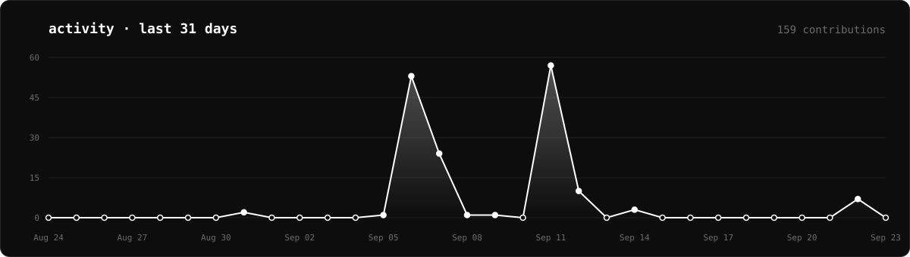

  

  

  
  

 

## `$ cat about.md`

I'm a **full-stack developer** working with **TypeScript, React, Node.js, Express and PostgreSQL**.

Lately I've been focused on **AI-assisted software engineering**: using LLMs and coding agents across the development workflow, from design and implementation to code review, testing and refactoring.

 

## `$ ls ~/stack`

  

also using

  

 

## `$ git log --stats`

  
  

  

  

  

 

  <picture>
    <source media="(prefers-color-scheme: dark)" srcset="./profile/snake-dark.svg" />
    <source media="(prefers-color-scheme: light)" srcset="./profile/snake-light.svg" />
    
  </picture>

 

## `$ ping mateus`

  
  

Open to new opportunities and collaborations.

 

