<p align="center">
  <a href="https://www.linkedin.com/in/mateusands/">
    
  </a>
</p>

<p align="center">
  
</p>

<p align="center">
  <a href="https://www.linkedin.com/in/mateusands/"></a>
  <a href="https://github.com/mateusands"></a>
  
</p>

<br />

## `$ cat sobre.md`

Sou **desenvolvedor full-stack**. No dia a dia trabalho com **TypeScript, React, Node.js, Express e PostgreSQL**, cuidando da API, do banco e da interface.

Fora do trabalho, gosto de entender como as coisas funcionam por baixo. Já fiz engenharia reversa do protocolo USB/HID de periféricos para escrever drivers Linux open-source, criei um motor de xadrez com minimax e montei chamadas P2P com WebRTC.

```ts
const mateus = {
  role: "Full-Stack Developer",
  stack: ["TypeScript", "React", "Node.js", "Express", "PostgreSQL"],
  alsoWrites: ["Python", "Go", "Shell"],
  os: "Linux",
};
```

<br />

## `$ ls ~/stack`

<p align="left">
  <a href="https://skillicons.dev">
    
  </a>
</p>

<sub>também uso</sub>

<p align="left">
  <a href="https://skillicons.dev">
    
  </a>
</p>

<br />

## `$ ls ~/projetos`

<p align="center">
  <a href="https://github.com/mateusands/Zugzwang">
    
  </a>
  <a href="https://github.com/mateusands/transmitir-100mil">
    
  </a>
  <a href="https://github.com/mateusands/open-m711pro">
    
  </a>
  <a href="https://github.com/mateusands/open-ek75">
    
  </a>
  <a href="https://github.com/mateusands/flag-rush">
    
  </a>
  <a href="https://github.com/mateusands/pdf-tool">
    
  </a>
</p>

<p align="center">
  <a href="https://mateusands.github.io/flag-rush/"></a>
  <a href="https://github.com/mateusands?tab=repositories"></a>
</p>

<br />

## `$ git log --stats`

<p align="center">
  
  
</p>

<p align="center">
  
</p>

<p align="center">
  
</p>

<p align="center">
  
</p>

<br />

<p align="center">
  <picture>
    <source media="(prefers-color-scheme: dark)" srcset="./profile/snake-dark.svg" />
    <source media="(prefers-color-scheme: light)" srcset="./profile/snake-light.svg" />
    
  </picture>
</p>

<br />

## `$ ping mateus`

<p align="left">
  <a href="https://www.linkedin.com/in/mateusands/"></a>
  <a href="https://github.com/mateusands"></a>
</p>

Aberto a conversar sobre vagas, projetos e drivers de periféricos obscuros.

<br />


