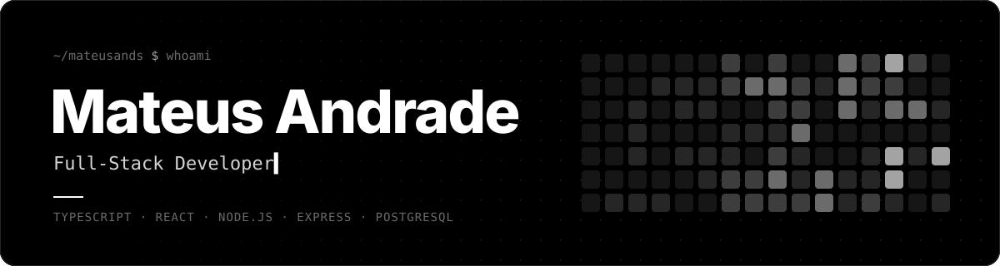
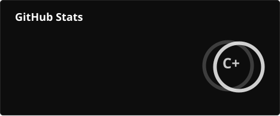
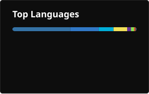
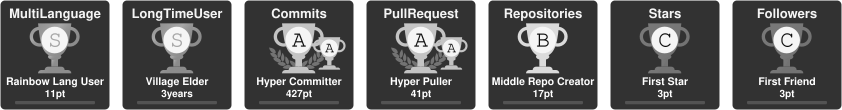

  

  

  
  
  

 

## `$ cat about.md`

I'm a **full-stack developer** working with **TypeScript, React, Node.js, Express and PostgreSQL**.

Lately I've been focused on **AI-assisted software engineering**: using LLMs and coding agents across the development workflow, from design and implementation to code review, testing and refactoring.

 

## `$ ls ~/stack`

  

also using

  
   
  
  

 

## `$ ls ~/work`

Production systems I built. Code and documentation are private.

<table>
  <tr>
    <td colspan="3">
      <h3>BPX Connect</h3>
      AI-powered customer service platform, multi-tenant and multi-brand.
      <ul>
        <li>Channel-agnostic message orchestrator with BullMQ and Redis queues that receives conversations, triages them and routes each one to the right flow</li>
        <li>AI pipeline with RAG, persistent memory and grounding against made-up answers, keeping support running 24/7</li>
        <li>Classification of sensitive Responsible Gambling topics, using rules and semantic analysis</li>
        <li>Knowledge base importer with deduplication and daily sync, plus a visual Flow Builder for designing flows</li>
      </ul>
      
    </td>
  </tr>
  <tr>
    <td width="33%" valign="top">
      <h3>Multi-brand webchat</h3>
      A single codebase generates each brand's widget, integrated with the bot and human support. Brand routing is handled with TaskRouter.
        
      
    </td>
    <td width="33%" valign="top">
      <h3>BPX Safe</h3>
      Responsible Gambling logging and tracking system that replaced spreadsheet-based control, with a full audit trail.
        
      
    </td>
    <td width="33%" valign="top">
      <h3>VIBEBPX</h3>
      Internal social network with feed, stories, chat and connections with colleagues from other departments. Peer recognition earns points redeemable in a rewards store, with rankings and goals per department.
        
      
    </td>
  </tr>
</table>

stack behind these projects

  
  
  
  
  
  
  
  
  
  
  

 

## `$ git log --stats`

  
  

  

  

 

  <picture>
    <source media="(prefers-color-scheme: dark)" srcset="./profile/snake-dark.svg" />
    <source media="(prefers-color-scheme: light)" srcset="./profile/snake-light.svg" />
    
  </picture>

 

## `$ ping mateus`

  
  
  

Open to new opportunities and collaborations.

 

